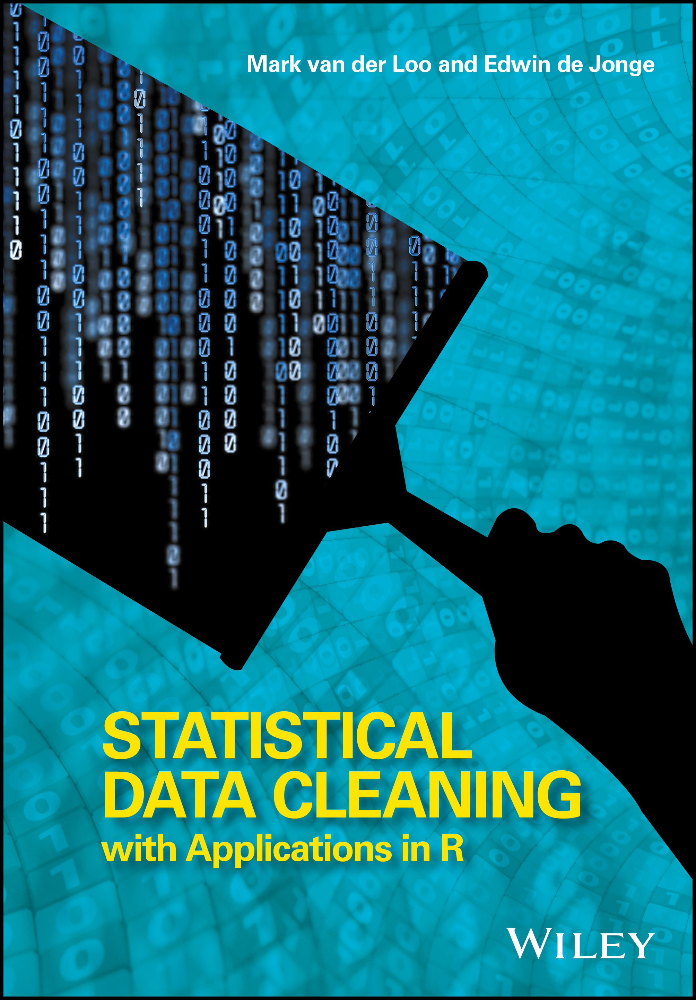

# ISM tutorial

<a href="https://www.amazon.com/Statistical-Data-Cleaning-Applications-R/dp/1118897153"></a>


Material for the workshop at the [Institute for Statistical Mathematics](https://www.ism.ac.jp/index_e.html) in Tokyo (JP), February 29, 2020.

Lecturers: Mark van der Loo and Edwin de Jonge

### Time table 


|Time slot     | Topic                 |
|--------------|-----------------------|
|13:30 - 13:45 | Opening               |
|13:45 - 14:45 | Hands-on lecture (1)  |
|14:45 - 15:00 | Break                 |
|15:00 - 16:00 | Hands-on lecture (2)  |
|16:00 - 16:15 | Break                 |
|16:15 - 17:15 | Hands-on lecture (3)  |
|17:15 - 17:30 | Discussion and closing| 


The course form is highly hands-on. Each topic starts with an approximately
10-15 minute session where you run and adapt some R code. Next, we will provide
background and details on what you just did. After that there is a more
in-depth assignment. Depending on time and topic we will discuss the topic more
in-depth after that.


### Prerequisites

**Bring a laptop**

Participants are expected to have a basic knowledge of R/RStudio, explicitly:

- Work with the R command line and R scripts
- Read/write CSV data
- Some basic data manipulations and plots
- We highly recommend working with RStudio projects.

### Software needed for the course

1. R See [https://r-project.org](https://r-project.org)
2. (Recommended) [Rstudio](https://rstudio.com)

Execute the following R code to install the necessary packages.

```r
install.packages(c(
        "validate"
      , "errorlocate"
      , "simputation"
      , "rspa"
      , "daff"
      , "jsonlite"
      , "XML"
      , "readr"
      , "stringr"
      , "lumberjack")
  , dependencies=TRUE)
```

### Course material

#### For users who have `git` installed

In `RStudio` go to `File` $\to$ `New Project...` $\to$ `Version Control` $\to$ `Git`,
and enter the follwong URL into the `Repository URL` field:

```
https://github.com/data-cleaning/ISM2020_tutorial
```

Or, use your OS's command-line
```{sh}
git clone https://github.com/data-cleaning/ISM2020_tutorial
```
And then open the `ISM2020_tutorial.Rproj` file with RStudio.

#### For users who do not have `git` installed

At the top of this webpage click `Clone or Download` and then `Download Zip`.
Unzip the file and open `ISM2020_tutorial.Rproj` with RStudio.


----
## License

[](http://creativecommons.org/licenses/by/4.0/)

This work is licensed under a [Creative Commons Attribution 4.0 International License](http://creativecommons.org/licenses/by-nc/4.0/).


